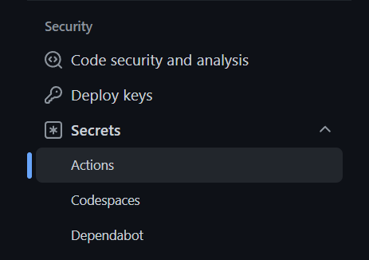
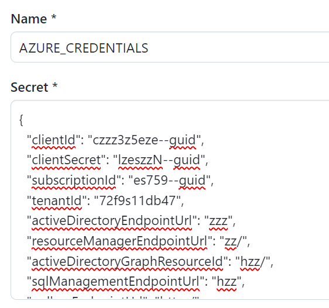
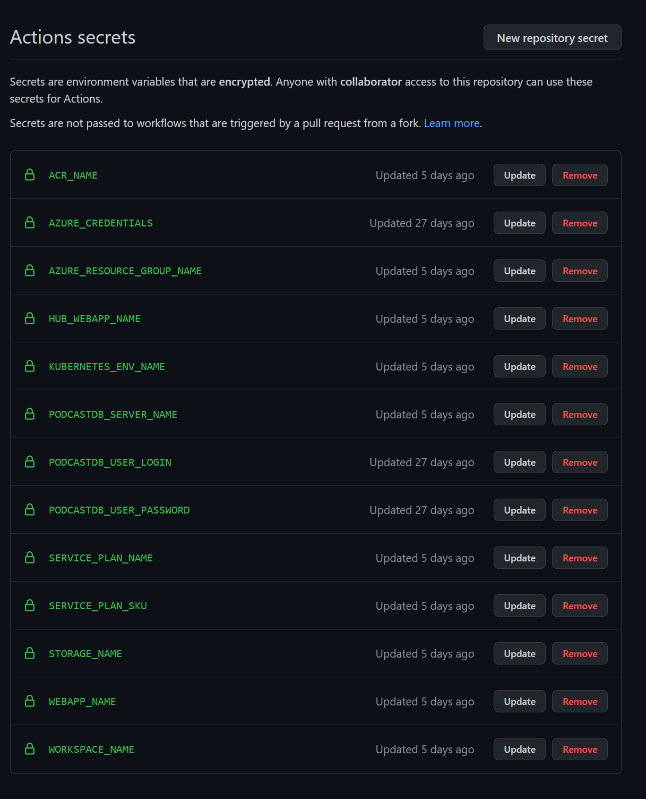
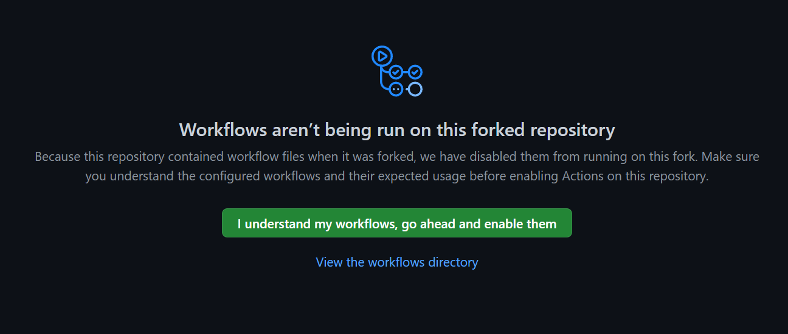

# Deploying websites and the backend services

`dotnet-podcasts` repo is configured to deploy all services automatically to Azure using GitHub Actions. This document will guide you in configuring GitHub Actions in your forked repository and help you deploy to your Azure resource group. Once they are configured correctly, you may go ahead and modify your source code, commit the changes and watch them deploy to your Azure resource group automatically.The CI/CD pipelines are all set for you!

> To get started, fork this repo first, and setup your Azure subscription. Follow the instructions step-by-step to configure the deployment pipelines correctly.

# New to Microsoft Azure?

You will need an Azure subscription to work with this demo code. You can:

- Open an account for free [Azure subscription](https://azure.microsoft.com/free/). You get credits that can be used to try out paid Azure services. Even after the credits are used up, you can keep the account and use free Azure services and features, such as the Web Apps feature in Azure App Service.
- [Activate Visual Studio subscriber benefits](https://azure.microsoft.com/pricing/member-offers/credit-for-visual-studio-subscribers/). Your Visual Studio subscription gives you credits every month that you can use for paid Azure services.
- Create an [Azure Student Account](https://azure.microsoft.com/free/students/) and get free credit when you create your account.

Learn more about it with [Microsoft Learn - Introduction to Azure](https://docs.microsoft.com/learn/azure).

## What services are being deployed to Azure?

To understand the dotnet-podcasts architecture better, see the diagram below.


- The backend services `Podcasts.API`, `Podcasts.Ingestion` and `Podcast.Updater` are deployed to [Azure Container Apps (Preview)](https://docs.microsoft.com/azure/container-apps/overview). [Azure Container Registry](https://docs.microsoft.com/azure/container-registry/) is used to store the docker images securely and Log Analytics Workspace is configured automatically to monitor telemetry.
- Web Apps including ASP.NET Core Website, Listen Together SignalR hub and the Blazor Web App are deployed to Azure App Service (Linux).
- Additionally, the app uses Azure SQL Databases and Azure Storage for managing data.

## Step-by-step guide to deploying websites and services to Azure

To keep this guide simple, we will be using Azure CLI in our next steps. If you haven't installed them, please take a look at the guide [How to install the Azure CLI](https://docs.microsoft.com/cli/azure/install-azure-cli) in your favorite platform. These instructions are only required for the first-time setup for GitHub actions. If it is easier, you may run the commands in the [Azure Cloud Shell](https://docs.microsoft.com/azure/cloud-shell/quickstart) and avoid local installation.

### Create an Azure resource group

First, you need to create an Azure Resource group within your subscription. If you have access to multiple Azure subscriptions, be sure to set it to the correct one before proceeding to the next step. See the guide [Change the active subscription](https://docs.microsoft.com/cli/azure/manage-azure-subscriptions-azure-cli#change-the-active-subscription) for details.

To create the resource group, run the following command in the terminal:

```console
az group create --name podcastrg --location canadacentral
```

The above resource group name will be added to the GitHub secrets in a later step. If you decide to use your own resource group name, be sure to update the same later.

Checkout [Azure CLI](https://docs.microsoft.com/azure/azure-resource-manager/management/manage-resource-groups-cli) or [Azure Cloud Shell](https://docs.microsoft.com/azure/cloud-shell/quickstart#create-a-resource-group) if you need additional help to set up a resource group.

### Register Subscription dependencies

Run the following command to ensure the following dependencies 

```console
az provider register --namespace Microsoft.ContainerRegistry
```

and also Microsoft.App

```console
az provider register --namespace Microsoft.App
```

> If you see errors similar to "The subscription is not registered to use namespace `'Microsoft.<ProviderName>'`", execute the command az provider register --namespace `'Microsoft.<ProviderName>'` in Azure CLI and re-run the failed jobs again.

### Configure Azure Credentials in GitHub Secrets

To connect GitHub Actions, you will create a secret named `AZURE_CREDENTIALS` that you can use to authenticate with Azure.

### Create a service principal and add it as a GitHub secret

1. [Create a new service principal](https://docs.microsoft.com/cli/azure/create-an-azure-service-principal-azure-cli) in the Azure portal for your app. The service principal must be assigned the Contributor role.

    ```console
    az ad sp create-for-rbac --name "podcastsp" --role contributor --scopes /subscriptions/{subscription-id}/resourceGroups/{resource-group} --sdk-auth
    ```

    > In the above command, replace the `{subscription-id}` with the GUID of your subscription. Run the command `az account show` and use the value of the "Id" property. Replace the `{resource-group}` with `podcastrg` or the resource group name you created earlier.

1. Copy the JSON object for your service principal.

    ```json
    {
        "clientId": "<GUID>",
        "clientSecret": "<GUID>",
        "subscriptionId": "<GUID>",
        "tenantId": "<GUID>",
        (...)
    }
    ```

1. Open your GitHub repository and go to **Settings**.

    

1. Under **Security** Select **Secrets** -> **Actions** and then **New repository secret**.

    

1. Paste in your JSON object for your service principal with the name `AZURE_CREDENTIALS`. 

    

1. Save by selecting **Add secret**.

### Configure all other GitHub Secrets

Go ahead and add the following GitHub secrets. Some of the values need to be unique since they expose a public endpoint. Those details are explicitly called out below. Except the Resource Group name, all others will be automatically created for you within your subscription. When naming the Azure Resources, be sure to check out the [naming rules and restrictions](https://docs.microsoft.com/en-us/azure/azure-resource-manager/management/resource-name-rules).

- `AZURE_RESOURCE_GROUP_NAME`: Use `podcastrg`. If you have changed it in the previous step, be sure to use that here.
- `PODCASTDB_USER_LOGIN`: Provide a user name for your database login.
- `PODCASTDB_USER_PASSWORD`: Provide a strong password for Podcast db  e.g., something like P0dc@st!022).
- `ACR_NAME`: Provide a container registry name. _This needs to be unique_. For e.g., `yournamepodcastacr`
- `STORAGE_NAME`: Provide a name for your Azure Storage. _This needs to be unique_. For e.g.,`yournamepodcaststg`
- `PODCASTDB_SERVER_NAME`: Provide an Azure SQL server name. _This needs to be unique_ For e.g., `podcastdbserver`
- `KUBERNETES_ENV_NAME`: Provide a Container apps environment name. For e.g,.`podcastskve`
- `WORKSPACE_NAME`: Provide a Log Analytics workspace name. For e.g., `podcastslogs`
- `SERVICE_PLAN_NAME`: Provide a Service plan name. For e.g., `podcastappserviceplan`
- `SERVICE_PLAN_SKU`: Provide a preferred SKU for the service plan. For e.g., `S1`.
- `HUB_WEBAPP_NAME`: Provide a Web App name for Listen Together SignalR Hub. _This needs to be unique_. For e.g., `yourname-podcasthub`
- `WEBAPP_NAME`: Provide a Web App name for the the websites._This needs to be unique_. For e.g., `yourname-podcastwebapp`

Once configured correctly, you should be having 13 secrets. Here's our list for reference:



That's it! You're all set. Now, let's run the configured Workflows, one by one, to deploy the Websites and Backend services. Be cognizant of pricing tiers for different services. You may want to adjust your App Service plan and database tiers to control costs.

### Enable the GitHub Workflows and run one by one

Go to the GitHub actions tab, and enable the workflows.



## Run the Podcast API CICD first

> IMPORTANT: The backend services need to be run first to set up all necessary dependencies, databases, and blob storage.  

You can manually run this from the `Actions` tab, click on `Select workflow` -> `Podcast API CICD` -> `Run workflow`. 

Wait for the workflow run to complete and execute the next steps. The first time you run this it will take a bit longer as it creates all of the Azure resources.

## Run the Podcast HUB CICD and  Podcast Web CICD workflows

Next we will wanto to deploy the listen together hub and the web app.

You can manually run the Hub action from the `Actions` tab, click on: 
* `Select workflow` -> `Podcast Hub CICD` -> `Run workflow`. 

> Note: If deploy fails, re-run as it may be a timing issue.
 
Then run the web action with:
* `Select workflow` -> `Podcast Web CICD` -> `Run workflow`

Once all the runs are complete, you'll see something like this under the Actions tab.


That's it! Now, Navigate to you https://`WEBAPP_NAME`.azurewebsites.net/ to watch the podcast app in action!

The GitHub workflow is also configured to deploy these apps only if the source within specific folders such as `src/Services/Podcasts/` is changed. So now, if you make some changes to the code, build locally, and then commit changes to see the GitHub workflow kickstart. Need any ideas for code change? You'll notice an empty `GlobalUsings.cs` in the `Podcasts.API` project. Go ahead refactor the code and move your global namespaces there.

Happy Deployments!

---
## Azure Container Apps Demo

To run the Azure Container Apps demo that we showcased at .NET Conf, checkout the [Azure Container Apps](docs/demos/azurecontainerapps).

## Individual Deployment Guides and Configurations

### ASP.NET Core Backend Services

1. .NET Podcast API:
    - [Run Backend Services Locally](src/Services/Podcasts/Podcast.API#run-backend-locally)
    - [Podcast images deployment to Azure Blob storage](deploy/Images)

1. Listen Together Mode Backend Services:
    - [Run Locally](src/Services/ListenTogether/ListenTogether.Hub)

### .NET MAUI Mobile & Desktop Apps

1. [Mobile & Desktop App Configuration](src/Mobile)

1. [Mobile & Desktop App with Blazor](src/MobileBlazor)

### ASP.NET Core Website & Blazor Web App

- [Deploy to Azure](src/Web#deploy-to-azure)
