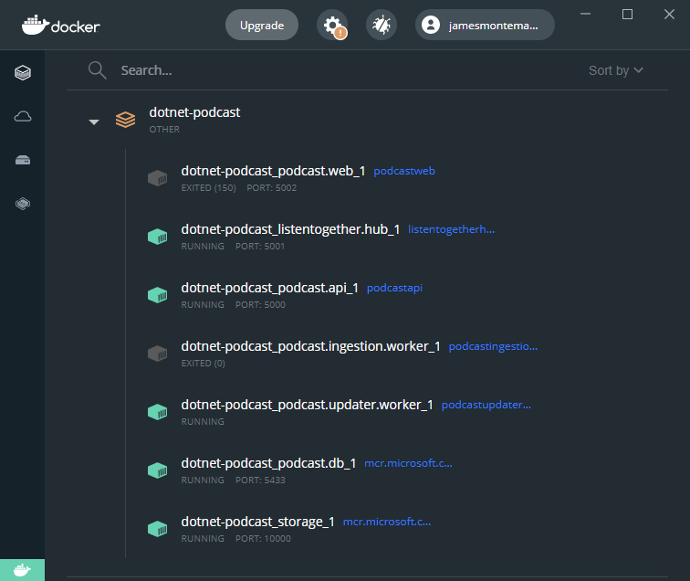
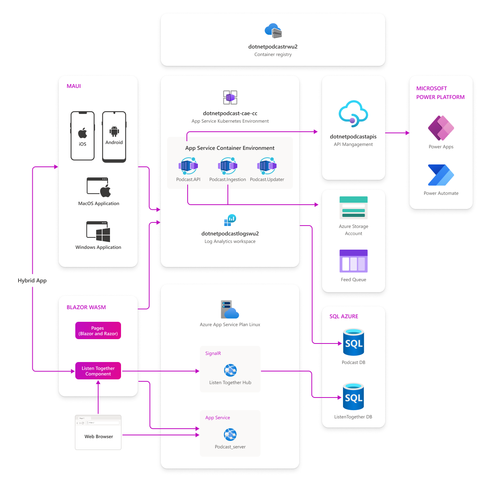

# .NET Podcasts - Sample Application

We are happy to announce the release of .NET Podcast App: a sample application showcasing [.NET 6](https://dotnet.microsoft.com/download/dotnet/6.0), [ASP.NET Core](https://dotnet.microsoft.com/apps/aspnet), [Blazor](https://dotnet.microsoft.com/apps/aspnet/web-apps/blazor), [.NET MAUI](https://docs.microsoft.com/dotnet/maui/what-is-maui), [Azure Container Apps](https://azure.microsoft.com/services/container-apps/#overview), and more.


## New to Microsoft Azure?

You will need an Azure subscription to work with this demo code. You can:

- Open an account for free [Azure subscription](https://azure.microsoft.com/free/). You get credits that can be used to try out paid Azure services. Even after the credits are used up, you can keep the account and use free Azure services and features, such as the Web Apps feature in Azure App Service.
- [Activate Visual Studio subscriber benefits](https://azure.microsoft.com/pricing/member-offers/credit-for-visual-studio-subscribers/). Your Visual Studio subscription gives you credits every month that you can use for paid Azure services.
- Create an [Azure Student Account](https://azure.microsoft.com/free/students/) and get free credit when you create your account.

Learn more about it with [Microsoft Learn - Introduction to Azure](https://docs.microsoft.com/learn/azure).

## Repositories

For this sample application, we build an app to listen all you favorite .NET podcasts for all the ecosystems: Web, Android, iOS, macOS and Windows. You can find the different apps separated by folders in this repo:

- [Mobile & Desktop:](src/Mobile) Native .NET MAUI Application for iOS, Android, macOS, and Windows
- [Website:](src/Web) Blazor WebAssembly app and ASP.NET Core Razor Marketing website
- [Backend API:](src/Services) ASP.NET Core Web APIs & Minimal APIs, injestion worker, and podcast update worker
- [Blazor Hybrid App:](src/MobileBlazor) Sample hybrid application of .NET MAUI with Blazor.


## Local Deployment Quickstart

The easiest way to get started is to build and run the .NET Podcasts app service, database, and storage using Docker. 

1. First install [Docker Desktop](https://www.docker.com/products/docker-desktop)
2. Clone the repository and navigate to the root directory in a terminal
3. Run the following docker command (this may take some time to pull images, build, and deploy locally)

```cli
docker-compose up
```

This will deploy and start all services required to run the web, mobile, and desktop apps. The Web API will run on `localhost:5000` and the SignalR Hub for listen together will run on `localhost:5001`.

### Web, Mobile, & Desktop

The apps are configured to speak to `localhost` on the correct ports for each service. Simply open the [Web solution](src/Web#solution) or the [.NET MAUI solution](src/Mobile) and run the app.

Ensure that you have the following services running in Docker (podcast.api, listentogether.hub, podcast.updater.worker, podcast.db, storage):



### Backend Services

Open the [Services solution](src/Services) and pick a service to run locally such as the `Podcast.API`.

Ensure that the following services are running in Docker, note that you only need the `podcast.db` and `storage`:


## Full App Setup and Deployment Guides

### ASP.NET Core Backend Services

1.  .NET Podcast API:
    - [Run Backend Services Locally](src/Services/Podcasts/Podcast.API#run-backend-locally)
    - [Deployment](src/Services/Podcasts/Podcast.API#deployment)
    - [Deployment Podcast Images](deploy/Images)

1. Listen Together Mode Backend Services: 
    - [Run Locally](src/Services/ListenTogether/ListenTogether.Hub)
    - [Deployment](src/Services/ListenTogether/ListenTogether.Hub#deployment) 

### .NET MAUI Mobile & Desktop Apps

1. [Mobile & Desktop App Configuration](src/Mobile)

1. [Mobile & Desktop App with Blazor](src/MobileBlazor)

### ASP.NET Core Website & Blazor Web App

1. Deployment:
    - [Deploy on Azure](src/Web#deploy-to-azure)
    - [Deploy using GitHub Actions](src/Web#deploy-using-github-actions)

1. [Solution](src/Web#solution)

## Demos

- [Azure Container Apps:](docs/demos/azurecontainerapps) In this demo, we will learn how to use Azure Container Apps and simulate a stress scenario where Azure Container App will have to auto-scale the service.

## Build Status


----

# Application Diagram



## Contributing

This project welcomes contributions and suggestions.  Most contributions require you to agree to a
Contributor License Agreement (CLA) declaring that you have the right to, and actually do, grant us
the rights to use your contribution. For details, visit https://cla.opensource.microsoft.com.

When you submit a pull request, a CLA bot will automatically determine whether you need to provide
a CLA and decorate the PR appropriately (e.g., status check, comment). Simply follow the instructions
provided by the bot. You will only need to do this once across all repos using our CLA.

This project has adopted the [Microsoft Open Source Code of Conduct](https://opensource.microsoft.com/codeofconduct/).
For more information see the [Code of Conduct FAQ](https://opensource.microsoft.com/codeofconduct/faq/) or
contact [opencode@microsoft.com](mailto:opencode@microsoft.com) with any additional questions or comments.

## Trademarks

This project may contain trademarks or logos for projects, products, or services. Authorized use of Microsoft 
trademarks or logos is subject to and must follow 
[Microsoft's Trademark & Brand Guidelines](https://www.microsoft.com/en-us/legal/intellectualproperty/trademarks/usage/general).
Use of Microsoft trademarks or logos in modified versions of this project must not cause confusion or imply Microsoft sponsorship.
Any use of third-party trademarks or logos are subject to those third-party's policies.
