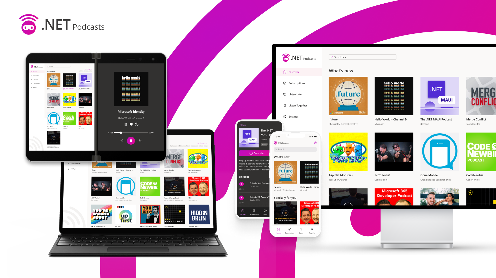

# .NET Podcasts - Sample Application

The .NET Podcast app is a sample application showcasing [.NET 6](https://dotnet.microsoft.com/download/dotnet/6.0), [ASP.NET Core](https://dotnet.microsoft.com/apps/aspnet), [Blazor](https://dotnet.microsoft.com/apps/aspnet/web-apps/blazor), [.NET MAUI](https://dotnet.microsoft.com/apps/maui), [Azure Container Apps](https://azure.microsoft.com/services/container-apps/#overview), [Orleans](https://docs.microsoft.com/dotnet/orleans/overview), and more.
In addition, an internal [Power App](https://docs.microsoft.com/en-us/power-apps/) was built to handle incoming podcast requests.

You can browse a [live running version of the .NET Podcasts app](https://dotnetpodcasts.azurewebsites.net/) powered by ASP.NET Core and Blazor.




## Application Architecture Diagram


## Repositories

For this sample application, we build an app to listen to all your favorite .NET podcasts for all the ecosystems: Web, Android, iOS, macOS and Windows. You can find the different apps separated by folders in this repo:

- [Mobile & Desktop:](src/Mobile) Native .NET MAUI Application for iOS, Android, macOS, and Windows
- [Website:](src/Web) Blazor WebAssembly app and ASP.NET Core Razor Marketing website
- [Backend API:](src/Services) ASP.NET Core Web APIs & Minimal APIs, ingestion worker, and podcast update worker
- [Blazor Hybrid App:](src/MobileBlazor) Sample hybrid application of .NET MAUI with Blazor.

Additionally, we build an application using [Microsoft Power Apps](https://docs.microsoft.com/en-us/power-apps/) to allow users to reject or accept incoming podcast requests.

- [Microsoft Power Apps:](src/PowerApps) Power Apps sample to handle incoming podcast requests.

## Full Deployment with GitHub Actions

`dotnet-podcasts` repo is configured to deploy all services and websites automatically to Azure using GitHub Actions. [Follow the detailed guidelines](Deploy-websites-services.md) to setup GitHub Actions on your fork.

## Local Deployment Quickstart

The easiest way to get started is to build and run the .NET Podcasts app service, database, and storage using Docker. 

1. First install [Docker Desktop](https://www.docker.com/products/docker-desktop)
2. Clone the repository and navigate to the root directory in a terminal
3. Run the following docker command (this may take some time to pull images, build, and deploy locally)

```cli
docker-compose up
```

- *For Apple arm64-based system*:
```cli
docker-compose -f docker-compose.arm64.yml -f docker-compose.override.yml up
```

This will deploy and start all services required to run the web, mobile, and desktop apps. The Web API will run on `localhost:5000` and the SignalR Hub for listen together will run on `localhost:5001`.

### Web, Mobile, & Desktop

The apps are configured to speak to `localhost` on the correct ports for each service. Simply open the [Web solution](src/Web#solution) or the [.NET MAUI solution](src/Mobile) and run the app.

Ensure that you have the following services running in Docker (podcast.api, listentogether.hub, podcast.updater.worker, podcast.db, storage):


### Backend Services

Open the [Services solution](src/Services) and pick a service to run locally such as the `Podcast.API`.

Ensure that the following services are running in Docker, note that you only need the `podcast.db` and `storage`:


## Local Deployment with Visual Studio

1. First install [Docker Desktop](https://www.docker.com/products/docker-desktop)
2. Clone the repository and navigate to the root directory in a terminal
3. Open the solution `NetPodcast.sln`, set the start project to `docker-compose` and hit F5. To optimize debugging while running all services, please refer to [Launch a subset of Compose services documentation.](https://docs.microsoft.com/visualstudio/containers/launch-profiles)
4. By default, the Podcast.Api's swagger endpoint will be launched. Navigate to `localhost:5002` for the web application. If you see any errors, wait for a while and refresh the page.

## Contributing

This project welcomes contributions and suggestions.  Most contributions require you to agree to a
Contributor License Agreement (CLA) declaring that you have the right to, and actually do, grant us
the rights to use your contribution. For details, visit https://cla.opensource.microsoft.com.

When you submit a pull request, a CLA bot will automatically determine whether you need to provide
a CLA and decorate the PR appropriately (e.g., status check, comment). Simply follow the instructions
provided by the bot. You will only need to do this once across all repos using our CLA.

This project has adopted the [Microsoft Open Source Code of Conduct](https://opensource.microsoft.com/codeofconduct/).
For more information see the [Code of Conduct FAQ](https://opensource.microsoft.com/codeofconduct/faq/) or
contact [opencode@microsoft.com](mailto:opencode@microsoft.com) with any additional questions or comments.

## Trademarks

This project may contain trademarks or logos for projects, products, or services. Authorized use of Microsoft 
trademarks or logos is subject to and must follow 
[Microsoft's Trademark & Brand Guidelines](https://www.microsoft.com/en-us/legal/intellectualproperty/trademarks/usage/general).
Use of Microsoft trademarks or logos in modified versions of this project must not cause confusion or imply Microsoft sponsorship.
Any use of third-party trademarks or logos are subject to those third-party's policies.
