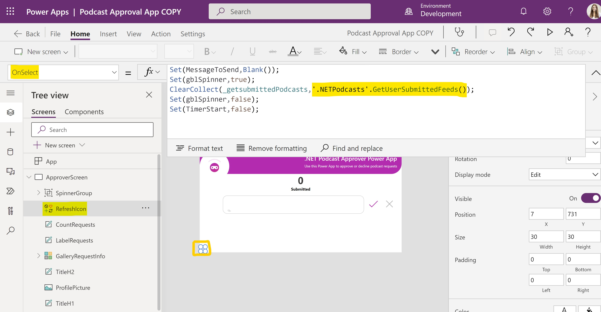

# Connecting APIs to the Microsoft Power Platform

Before getting started, ensure that you have successfully imported the Approval App into your Power Apps environment. Follow the detailed guidelines [here](https://github.com/user/repo/src/PowerApps/README.md)

# Create a custom connector

[Custom connectors](https://docs.microsoft.com/en-us/connectors/custom-connectors/) are a powerful way to connect to any existing API from within Power Apps. A custom connector is a wrapper around a REST API that allows the Power Platform to communicate with your REST API.

From within Azure API Management, you can easily create such custom connectors. [Follow the detailed guidelines](https://docs.microsoft.com/en-us/azure/api-management/export-api-power-platform) on how to export your API from API Management.

# Connect your Podcast Approval application with your web API

Open your Podcast Approval App within Power Apps:

You will see a lot of error messages within your Power App:

To fix these, we will have to add the custom connector to your app via the data tab:

*Note: Search for the name of your custom connector created via API Management. If you have enabled subscription keys. You can find the subscription key within the Azure Portal in your API Management instance under Subscriptions.*

# Modify your Power App

Next, we have to update our Power App via the Power Editor.

## OnStart

Every time someone opens up the Power App, we want to make an API call getting us the information about current requests. For this we have to change our [OnStart behavior](https://docs.microsoft.com/en-us/power-platform/power-fx/reference/object-app) for the Power App. We update **'.NETPodcasts'.GetUserSubmittedFeeds()**:

Additional Information:
- **'.NETPodcasts'** is referencing the name of the custom connector
- **GetUserSubmittedFeeds()** is referencing the API's method name

# Refresh Button

We also implemented a refresh button, for this we also have to update **'.NETPodcasts'.GetUserSubmittedFeeds()**:
